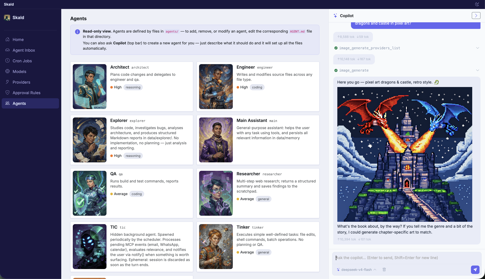

# Skald 🔥

> ⚠️ **Active development** — expect breaking changes. Things move fast.

<table><tr><td width="220"></td><td>

**Skald** (also **Skáldkonur**) is a local AI assistant that lives on your machine — named after the Norse tradition of women skalds, the poet-warriors who wove history, memory, and wisdom into verse. It chats with you, helps you get things done, and — because it can rewrite and restart itself — grows with you.

It's not a chatbot you talk to. It's a partner that nudges you, remembers what matters, and runs tasks on your behalf: reading your email, checking your calendar, sending WhatsApp messages, writing code, researching the web, generating images, and more.

</td></tr></table>

## Why this exists

I built this because my life fell apart — and I needed something to help me put it back together.

Not a chatbot you type at when you feel like it. Something that would be **on me**. That would check in when I was avoiding things, push when I was procrastinating, and keep track of everything I was dropping. I needed an assistant that wasn't reactive — waiting for my question — but proactive. That would say *"you said you'd call the dentist today, it's 5pm, did you do it?"* without me having to ask.

I also wanted it to know me. Not just my prompts — my patterns, my forgetfulness, my blind spots. Over time, to learn what actually matters to me and what's noise.

This project is that experiment. It started as a desperate hack and turned into a daily companion that I genuinely rely on. It's still rough, but it works — and it keeps getting better.

## Features

### 💬 Conversational agent

A chat interface where you talk to the LLM like you would any assistant. Sub-agents can be delegated tasks — research, coding, planning — and report back. *(screenshot)*

### ♻️ Self‑rewriting

This app can change everything about itself. It reads, edits, and rewrites its own source code — then restarts to run the new version. You can ask it to add a feature, change its personality, or completely repurpose itself.

The idea is that **this is an almost‑empty container**. A starting point. Want an AI editor for books? Start here. Want an assistant that does something very specific? Take this code and tell the agent to rewrite itself into whatever you need. It's a meta‑tool: a program that can become any program you describe.

Need a Discord plugin? Ask the agent — it writes the code, restarts, and guides you through connecting it. Need a specific MCP server? The agent knows how to build and register one. You don't need to know the code. Just describe what you want.

### 🧠 Memory system

Two layers work together:

- **File-based memory** — the agent writes notes to markdown files in `data/memory/`. It manages these autonomously, like a personal wiki.
- **Honcho** (optional but highly recommended) — a self-hosted memory server that extracts long-term conclusions about you from every conversation. Over time, the agent knows your preferences, habits, and context. *(screenshot)*

### 🔌 Multi‑LLM support

Works with OpenAI, Anthropic, OpenRouter, Ollama, LM Studio, DeepSeek — anything with an API. Each agent can use a different model depending on the task. You can switch on the fly. *(screenshot)*

> **Recommended models today:** DeepSeek v4 Flash (average reasoning) is great for everyday chat and light coding — writing MCP servers or skills. DeepSeek v4 Pro is better for heavy architectural work — new complex plugins, major rewrites, anything that needs deep reasoning.

### ✅ Approval system

The agent can do a lot on its own, but some actions are too sensitive to run unchecked. Before executing shell commands, writing to important files, or restarting the server, the agent pauses and asks for your approval.

A request pops up in real time — you see exactly what the agent wants to do, with a diff when files are involved. Approve, reject, or add a note. If you're away, pending requests collect in the **Agent Inbox**, waiting for you to come back and decide. *(screenshot)*

The rules are fully configurable: you decide which tools, agents, or paths require approval, which are always allowed, and which are blocked entirely. The agent never acts on your machine without your say-so. *(screenshot)* *(screenshot)*

### 🎨 Multi‑modal

- **Image generation** — describe what you want, the agent generates it (OpenRouter, Grok, etc.)
- **Speech‑to‑text** — send a voice message, get it transcribed (OpenAI Whisper API or local whisper.cpp)

### 👁️ Background agent (TIC)

Every 15 minutes, a background agent checks your incoming events and decides what matters:

- **Gmail** — new emails, important senders
- **Google Calendar** — upcoming events, changes
- **WhatsApp** — new messages

If something needs your attention, it briefs your conversational agent, which can then alert you. The notification rules are **yours** — you tell the agent what to filter and what to escalate. *(screenshot)*

### ⏰ Cron jobs

Tell the agent *"send me a daily summary at 9am"* or *"check the weather every morning and remind me to take an umbrella"*. The agent creates, manages, and runs scheduled tasks — no crontab editing. *(screenshot)*

### 🔌 Plugins

| Plugin | What it does |
|--------|-------------|
| **Telegram** | Chat with your agent from Telegram — full interaction, including approval requests |
| **Tailscale** | Connects your agent to your tailnet, accessible from any device in your mesh |
| **Honcho** | Long-term memory server (personality extraction, conversation context) |
| **Whisper (local)** | On-device speech-to-text via whisper.cpp |

Want to enable a plugin? Ask the copilot in the web UI, or any other active chat session — it will guide you through the setup step by step.

### 🧩 MCP servers

Model Context Protocol servers give the agent direct access to external services:

| MCP server | Tools exposed |
|-----------|--------------|
| **Google Calendar** | List events, create/update/delete, RSVP |
| **Gmail** | Read, send, search, manage labels |
| **Google Maps** | Transit directions, places, geocoding |
| **WhatsApp** | Read messages, send messages, list chats |
| **Tavily** | Web search and research |
| **Web fetch** | Download and extract any URL |

More can be added at runtime — the agent can write new MCP servers from scratch, modify existing ones, or register them on its own.

### 🌐 Web app

<table><tr><td width="270"><a href="assets/images/screenshot-web-app-agents-page.png"></a></td><td>

The UI runs in the browser — **localhost:3000**. Open it from any device on your network. Pair it with the Tailscale plugin and it's accessible from anywhere.

Use it as a pinned tab, a standalone window, or your phone browser.

</td></tr></table>

### 🔒 Remote access via Tailscale

Enable the Tailscale plugin and the web app becomes accessible from any device on your tailnet — including your phone, from anywhere in the world. Just ask the agent to activate it and it will guide you through the setup.

### 📱 Mobile app

<table><tr><td width="220"><a href="assets/images/skald-mobile-app-screen.png"></a></td><td>

The web app works on mobile — add it to your phone's HomeScreen and use it to chat with the agent, approve pending requests, and manage your inbox remotely.

⚠️ **Current status**: the mobile web app works, but **push notifications are not yet implemented** — you need to open the page to see new requests. The mobile web app is still a work in progress.

</td></tr></table>

## Getting started

The only prerequisite is **Cargo** (Rust's build tool and package manager).

### Install Cargo

**macOS (Homebrew):**
```sh
brew install rust
```

**Windows:**
Download and run [rustup-init.exe](https://rustup.rs/) — it installs Rust and Cargo with the default options.

**Any platform (rustup):**
```sh
curl --proto '=https' --tlsv1.2 -sSf https://sh.rustup.rs | sh
```

### First launch (no config needed)

Skald runs out of the box with zero configuration:

```sh
./run.sh
```

The script sets up a Python virtualenv (optional — needed for MCP servers like Gmail/Calendar) and runs the app in a supervisor loop.

Open `http://localhost:3000` in your browser. Everything else — SQLite, web server, MCP connections — is handled automatically.

> To customise settings (ports, logging, etc.), edit `config.yml` — it is created automatically on first launch from `default.config.yaml`.

### Windows

```batch
run.bat
```

Same behavior — creates a Python venv if available and runs the supervisor loop.

Open `http://localhost:3000` in your browser. Everything else — SQLite, web server, MCP connections — is handled automatically.

### Docker

If you'd rather not install Rust locally, you can run Skald in a container:

```sh
docker build -t skald .
touch database.db && mkdir -p data
docker run -p 3001:3000 \
  -v ./data:/app/data \
  -v ./database.db:/app/database.db \
  skald
```

Open `http://localhost:3001`. The container includes the full Rust toolchain, so self-recompilation (`restart` tool) works just the same.

For custom config, multi-platform builds, Docker socket access, and other options, see [docker.md](docker.md).

### Add an LLM provider and model

Once the app is running, the last step is to register at least one **LLM provider** and a **model**. Go to the **Models Hub** in the web UI (`localhost:3000/models`) and add:

1. An LLM provider (e.g. OpenRouter, OpenAI, Anthropic)
2. At least one model assigned to that provider

All credentials are stored in SQLite and managed entirely through the web UI — no config file editing required.

> **Recommended:** DeepSeek v4 Flash for everyday conversation, and DeepSeek v4 Pro for complex architecture and coding tasks. Flash is fast and cheap; Pro has deeper reasoning for heavy work.

## Status

This is a personal project, actively used every day. It's not a polished product — it's a living tool that changes as I need it to.

Breaking changes happen. The database schema may shift. The config format may change. If you try it and something breaks, open an issue — but also expect things to be rough around the edges.

That said, it works. It helps. And it's only going to get better.

---

Built with Rust, Tokio, Axum, SQLite, and a lot of coffee.

Rust was a deliberate choice: a single statically-linked binary with no runtime and no interpreter. The release build weighs ~36 MB and runs comfortably on a Raspberry Pi or a low-power NAS — the kind of hardware that's already on 24/7 at home. The goal was an assistant that lives *on your machine*, including the smallest one you own.
